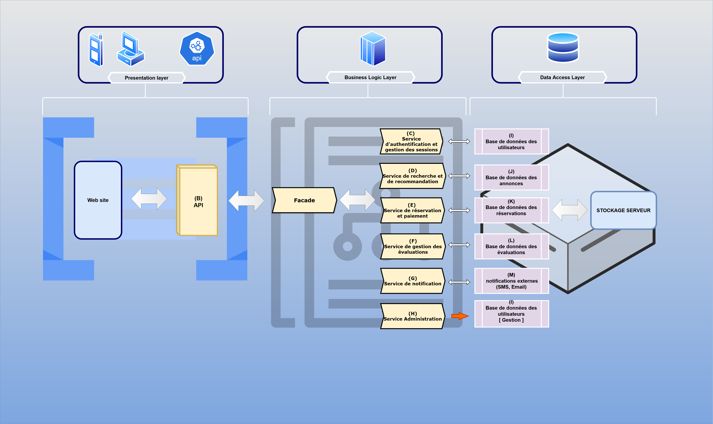

# Project-1
## Introduction

This document serves as a comprehensive technical blueprint for the HBnB project. It compiles all diagrams and explanatory notes created during the design phase, providing a clear reference for the system's architecture and design. This documentation will guide the implementation phases and serve as a valuable resource through the project.

### Purpose and Scope

The purpose of this document is to:
- Present a cohesive overview of the HBnB project's architecture
- Provide detailed insights into the system's design decisions
- Offer a clear understanding of component interactions and data flow
- Serve as a reference guide for developers during implementation

## High-Level Architecture

### High-Level Package Diagram

### Explanation
This section describes the layered architecture and facade pattern used in the HBnB project. It outlines the main components and their interactions at a high level.

### Presentation layer

Components :

- Website: The user-facing interface that enables interaction with the system through a graphical UI.
- API: Exposes endpoints for external clients or other systems to interact with the business logic.

Responsibilities :

- Handles user interactions and requests.
- Communicates with the Business Logic Layer through the API.

Conclusion :

- This layer is kept distinct to enable multiple clients to interact with the system while ensuring flexibility. The API ensures standardized communication with the backend.

### Presentation layer

Components :

- Website: The user-facing interface that enables interaction with the system through a graphical UI.
- API: Exposes endpoints for external clients or other systems to interact with the business logic.

Responsibilities :

- Handles user interactions and requests.
- Communicates with the Business Logic Layer through the API.

